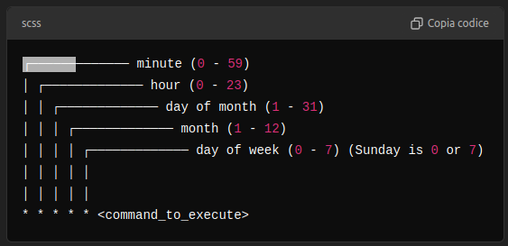

# Automatically update folder into GitHub

If you want to automatically update a repository and commit changes to GitHub, you can schedule an add/commit/push sequence using [crontab](https://www.webarea.it/howto/linux/utilizzo-di-crontab-per-schedulare-processi-con-esempi-sotto-linux_1). This program can finely schedule based on the hour, day of the week, day of the month, or even month  multiple works, running them in the background.

## Writing the script to run

First thing, we need to write the script we want crontab to run. An example script to do so is the following one

```bash
#!/bin/bash

#This script automatically updates chosen repositories every 2 hours. this script only works if SSH agent correctly manages our our keyes. Remember to automatically turn it on in .bashrc every time you log in

#repositories to automatically
script="<path_to_folder_to_update>"

#navigate to the repository. || is a logical OR: if bash cannot navigate to "$script" then it exits the script
cd "$script" || exit

#add all changes of the folder
git add .

#create the commit
git commit -m "Automated commit of scripts on $(date '+%Y-%m-%d %H:%M:%S')"

#push commit
git push origin main
```

As it has been written in the description of the script, if we use the SSH agent most common for Linux, it cannot maintain stored the passwork of our SSH key. For this reason we have to create a new couple of SSH keys without adding any password. We can do it following the [GitHub tutorial](https://docs.github.com/en/authentication/connecting-to-github-with-ssh/generating-a-new-ssh-key-and-adding-it-to-the-ssh-agent) again.

Moreover, we have to start the SSH agent every time we log in into the server. For this reason we have to add to our '.bashrc' file the following lines.

```bash
# Enable SSH Agent on Startup
eval "$(ssh-agent -s)"
ssh-add ~/.ssh/id_ed25519
```

## Set up a Cron job

Before anything alse, we have to make the script automatically executable. To do it we use 'chmod'.

```bash
chmod +x <path_script>
```

Then we can open the Cron editor with 'crontab -e'. Here we apply the syntax of the editor that follow the one explained in this image.



If we want only to run the script every 20 minutes from 9.00 to 11.00 on Mondays and Tuesdays, and from 14.00 to 16.00 on Wendsday only from September to February, we add the following lines.

```bash
*/20 11-12 * 9-12 1,2 <script_path>
*/20 11-12 * 1-2 1,2 <script_path>
*/20 14-15 * 9-12 3 <script_path>
*/20 14-15 * 1-2 3 <script_path>
```

Once you exit the editor saving the file, Crontab will run in background the requested jobs.
