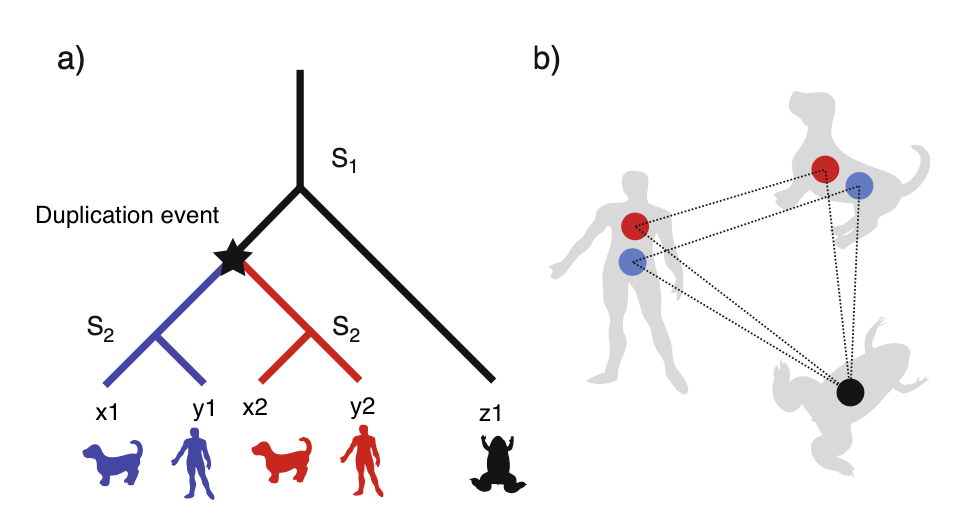

# Ortholgy inference

When setting up a phylogenetic/phylogenomic project, the first necessary step is identify **orthologs genes..**. Even before, you need to create your personal dataset ([dataset_creation.md](./dataset_creation.md))

## Orthologs, Paralogs and Orthogroups

### What are orthologs and paralogs genes?

* Orthologs are commonly defined as pairs of genes that started diverging after **speciations** events.  
* Paragols genes, on contrary, started diverging after **duplication** events.  

### Why in phylogenetics inference we are interested in strictly orhologs genes?

*"Phylogenies require orthologous, not paralogous genes"* [Walter M. Fitch](https://academic.oup.com/sysbio/article-abstract/19/2/99/1655771).  

By definition, since orthologs genes arise by speciation events, they share the same evolutionary history of the underlying species. Moreover, beside phylogentics, orthologs genes should share the same **biological function**, while paralgos genes are belivied to differ in function (‘ortholog conjecture’ [Nehrt et al., 2011](https://journals.plos.org/ploscompbiol/article?id=10.1371/journal.pcbi.1002073)).

However, as usual in biology, be aware of this latest corollary, recently ortholog conjecture has been largely questioned (see [Stamboulian et al., 2020](https://academic.oup.com/bioinformatics/article/36/Supplement_1/i219/5870499) and [Lynch and Conery, 2000](https://science.sciencemag.org/content/290/5494/1151.abstract?casa_token=xqdhpSn423QAAAAA:mi5ecKfOTYeHPuelYUEP0zBd7gM-fEVWJDjZktvNo-bfFX5XjY44ns7epbpUHi9DmqzPv7id9Km2jA), [Gout and Lynch, 2015](https://academic.oup.com/mbe/article/32/8/2141/2925587?login=true) for for some interesting hints on fate of duplicated genes )

**Just to make things more complex...**

### Classification of ortologs and paralogs

Orthology is **always** defined by phylogenetics and unit of comparison:

1. **One-to-one orthologs:** in both species is present only one copy of the gene, arise after speciation event (x1 and y1, x2 and y2).
2. **Many-to-one** and **one-to-many ortologs:** after specieation event, one or more duplication events occured in one of the two lineages, as a result we have **three or more** ortholog genes (x1, y1, and z1)!
3. **Many-to-many ortologs:** after speciation event, one or more duplications events occured in both lineages, as a result we have **multiple copies** of ortologs genes.
4. **Paralogs:** (x1 and x2, y1 and y2)
5. **In-paralogs:** is definied over a triplet. It involves a pair of genes and a speciation event of reference. A gene pair is an in-paralog if they are paralogs and duplicated after the speciation event of reference (x1 and x2 with respect to S1).
6. **Out-paralogs:** is also a relation defined over a pair of genes and a speciation event of reference. This pair is out-paralogs if the duplication event through which they are related to each other predates the speciation event of reference (x1 and x2 with respect to S2).



...and others (see chapter "Inferring Orthology and Paralogy" [Anisimova, 2019](https://core.ac.uk/download/pdf/289121767.pdf)).

### and Orthogroups?

An orthogroups is a group of orthologs genes descending from the **last common ancestor** (LCA) of a group of species. (*i.e.* extension of concept of orthology to multiple species). An orthogroup is always defined by a reference speciation event!

**In phylogenomics one of the most common things is to use only 1-to-1 ortologs** (Orthogroups with only one copy for each specie)
**However the study of gene families (paralogs + orthologs genes) evolutionary dynamics is getting more and more attention in the latest years**

### How can we identify orthologs?

If we are setting up an experiment involving the Sanger sequencing of a marker, we should know *a priori* that all fragments are orthologs between each other (choose the markers and primers based on bibliography knowledge). A common way is to use mtDNA sequences and nuclear ribosomial RNA (*e.g.* 28s).

If we are dealing with NGS data such as transcriptomes or WGA we have a lot of nice software to choose from, one of the most popolar is...

## [Orthofinder](https://github.com/davidemms/OrthoFinder) (no more than 15 minutes with 40 CPUs)

In brief, Orthofinder alghoritm is subdivided into 4 major steps:

1. **Orthogroups inference** using *bi-directional best hit (BBH)*, costruction of orthogroup graph and clustering genes into discrete ortogroups.
2. **Inference and rooting** of **specie** tree.
3. **gene tree** inference and rooting for each orthogroup.
4. Inference of **orthologs and gene duplication events** reconciling rooted specie and gene trees.

The detailed explanation of each step is not the aim of this course, however if you are interested in orthology inference you should have a look at the two Orthofinder papers ([Emms and Kelly, 2015](https://genomebiology.biomedcentral.com/articles/10.1186/s13059-015-0721-2?optIn=false) and [Emms and Kelly, 2019](https://genomebiology.biomedcentral.com/articles/10.1186/s13059-019-1832-y)). Just take in mind the extremely importance of the *bi-directional best hit*, indeed is the only way to take into account possible gene loss in one of the two lineages. (Think about what can happen in orthology inference if the blue human gene in figure 1A would be lost...).

Beside these teoretically, but important questions, one of the most valuable things about Orthofinder is its *usability*. A *quick-and-dirty* Orthofinder analyses can be simply run with:

```bash
orthofinder -f <proteoms_folder>
```

> Remember to remove isoforms from a proteom before performing OG inference
> Remember that it is always a good practice to rename (using e.g. `sed`) proteome headers just be sure to keep a unique identifier. *e.g* `<SPECIE_NAME>|<PROTEIN/GENE_NAME>` or `<PROTEIN/GENE_NAME>|<SPECIE_NAME>`. In our pipeline it is not demanding since Orthofinder run will paste the name of the proteome to the sequence header, doing it for us.

NB: In our case having the species name clearly separated from the gene/protein name is **foundamental**!

Orthofinder will print a lot of usefull ouputs. Some of the most important (IMO) are: `Comparative_Genomics_Statistics/Statistics_Overall.tsv` and `Comparative_Genomics_Statistics/Statistics_PerSpecies.tsv`

Orthogrorups can be found in:

* `Orthogroup_Sequences`
* `Single_Copy_Orthologue_Sequences`

We are going to use these latest files for a simple phylogenetic inference.

## Paralog filtering

After orthology inference, paralogs can get into the way. There are many programs that deal with this problem. Two are [DISCO](https://github.com/JSdoubleL/DISCO/) and [PhyloPyPruner](https://pypi.org/project/phylopypruner/). Differently than Orthofinder, these two program compute phylogenetic tree-based orthology inference. To make everything easier we will use DISCO.

DISCO script requires a specific header syntax to properly work. Luckily, the supported syntax is the one we alrady implemented and used so far (SPECIES|SEQUENCE_ID). The script wants as inputs simple gene tree, **not** resolved ones (they represent a more direct Orthofinder output without any further elaboration). Before running it install treeswift if it is not in `text_env`.

```bash
pip install treeswift #it is a common command to install python modules
python3 disco.py -i <TREE> -o <OUTPUT> -d "|" -m <N_SPECIES_TO_MAINTAIN> --remove_in_paralogs --single_tree --keep-labels --verbose 2>/dev/null
```

You can find the disco script here `/home/PERSONALE/mirko.martini3/00_Lab_CompGeno/2024/05_OG.Inference_Phylogenomic/disco.py`

with:

* -i #input tree file
* -o #output file name
* -d #delimiter between species name and sequence name
* -m #number of species that the polished tree, after paralogs pruning, should contain at least
* --remore_in_paralogs #Remove in-paralogs before rooting/scoring tree.
* --single_tree #only output single large tree
* --keep-labels #Keep original leaf labels instead of relabeling them with their species labels

This last option is particular important since we are using DISCO a bit improperly. Maintaing labels is indispensable since we are working on trees and not orthogroups, so we have to rebuild these last ones after the pruning. To do it, we will use the script [recreate_disco_ortho.sh](./recreate_disco_ortho.sh). The only thing to do specify in place of ORIGINAL_FOLDER the folder containing original orthogroups inferred by Orthofinder. Before that remember to delete those files that did not pass our filter and had not been populated (N.B. try to do it by yourself)

You can find the script `recreate_disco_ortho.sh` in `/home/PERSONALE/mirko.martini3/00_Lab_CompGeno/2024/05_OG.Inference_Phylogenomic/recreate_disco_ortho.sh`

## Alignments and trimming

Our fist step is building a species tree where branches are proportional to the mean amino acid change among species. We will work for this task with single copy complete orthogroups, those that contain every species and only one sequence for each of them.

Now we can perform single-gene alignments using [mafft](https://mafft.cbrc.jp/alignment/server/) in AUTO mode.

```bash
mafft --auto --anysymbol <FASTA_FILE> > <OUTPUT_FILE>
```

**SUGGESTION:** Since you will likely have hundreds of genes, try to use a `for` cycle.

Usually when working with alignments is a good idea to remove gappy position and/or unalignable regions. This step could not only improve species-tree inference but also speed up analyses. For this task we are using [BMGE](https://gitlab.pasteur.fr/GIPhy/BMGE).

BMGE is a sequence trimmer developed to improve the quality of multiple sequence alignments by identifying and removing poorly aligned regions using an entropy-based approach. Another important parameter is `-g`, which specifies how to treat gap positions (vertically, positions with more than <row_rate>% absence are eliminated).

```bash
bmge -i <input_alignment> -t AA -m BLOSUM30 -e 0.5 -g <gap> -of <OUTPUT_FILE> -oh <OUTPUT_HTML>
```

With:

* -jar #identify the program executive file
* -i #input alignment files
* -t #sequence type. in this case AA
* -m #matrix. When compared species are dissimilar, it is recommended to use always BLOSUM30
* -e #maximum entropy value
* -g #<row_rate> : real numbers corresponding to the maximum gap rates allowed character
* -of #output in FASTA format. Define also the output name
* -oh #output in HTML format. Days of a future past: these outputs will be understood later

**SUGGESTION:** Since we will likely have hundreds of genes, try to use a `for` cycle.

To perform a species-tree inference following a supermatrix approach now we need to concatenate our single-gene alignments. Before doing so, you need to modify the header of trimmed aligned OGs keeping only the species name. This step is necessary if you want to concatenate all genes in a single super-matrix.

```text
>SPECIE_NAME
```

```bash
AMAS.py concat -y nexus -i <SINGLE_GENE_ALIGMENTS> -f fasta -d aa -t <name_output>
```

Where:

* concat #enables the concatenator function of AMAS
* -y #specify the output format
* -i #input files. They all need to be listed
* -f #format of the input files
* -d #type of sequence (amino acid)

You can find AMAS here `/home/PERSONALE/mirko.martini3/00_Lab_CompGeno/2024/05_OG.Inference_Phylogenomic/AMAS.py`.

Once we have concatenated the alignments we can directly run a phylogenetic analyses using the so called "super-matrix" and the partition file if we want to perfom a partition-based analyses (usually recomanded; see [here](http://www.iqtree.org/doc/Advanced-Tutorial) for a tutorial). For an unpartitioned analyses we only need the command:

```bash
iqtree -m TESTNEW -bb 1000 -s <TRIMMED ALN> --prefix <PREFIX> -nt AUTO
```

Congrats you have a species tree on which perform gene families evolutionary analyses! Take in mind that you can try to perform more sophisticated analyses using partition models!
