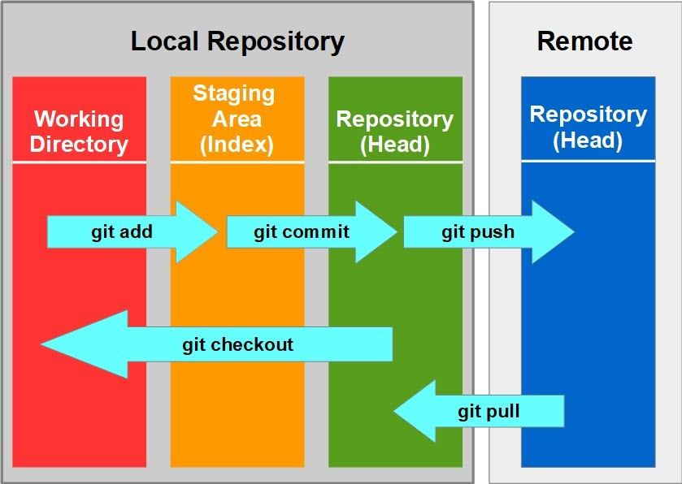
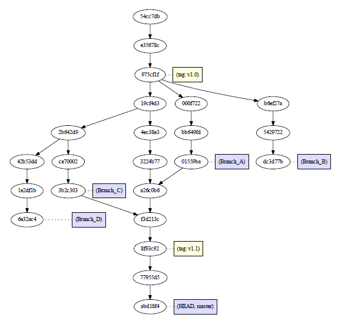

# Git and GitHub

[Git](https://git-scm.com/) is a version control system used to track changes in files and coordinate work on those files among multiple people. [GitHub](https://github.com/) is an hosting service for Git repositories.

To synchronise our first repository we can follow one of the many useful [tutorial](https://docs.github.com/en/repositories/creating-and-managing-repositories/cloning-a-repository?platform=linux&tool=webui) that GitHub developers have written during these years. Using the 'ssh URL' instead of the 'hhtp URL' makes things easier.

usefult commands:

```bash
git add <file1> <file2> <...> #add file to the stagin area
git commit -m "commit message" #creates a new a commit 
git push #push any new commit
git pull #pull any changes from online repositories
git rm <file> #remove any file automatically adding this change to the staging area
git mv <file> #mv any file automatically adding this change to the staging area
git status #display the current state of the git repository
```

## SSH keys

We need to give permission to our local repository to contact the online one and exchange information. To so so, we can follow this [tutorial](https://docs.github.com/en/authentication/connecting-to-github-with-ssh/generating-a-new-ssh-key-and-adding-it-to-the-ssh-agent) creating a pair of ssh-keys that can allow the correct autentication between local and origin repositories. When you will be asked to choose a password, take into consideration the possibility to not choose one. It seems counterintuitive, but it lets you have more room for automatisation. For example, in this way you can write a script that automatically can update and synchronise your entire repository every day, even if you forget to do it. This is possible using the tool `crontab`, which is designed to launch periodical background commands. To do so, follow instruction present [in time scheduled command](./time_scheduled_commands.md).

## How Git works



## Gitignore

A very useful file is [.gitignore](https://docs.github.com/en/get-started/getting-started-with-git/ignoring-files). This file allows to list all files that we do not want to synchronise with out online repository, because to big or not useful. As always, it is only a common text file which containes extensions and file to ignore. a good starting point is to ignore all fasta and logs file. If in any way they become important, it is only possible to force those we want.

## Retracing our steps

The command `git restore` substituted the tasks that `git checkout` did on files.

### Files

```bash
git rm #rm a file from working directory and add the change in the staging area
git rm --cached #remove file only from the git synchronisation
git restore <filename> #discard uncommitted changed in the working directory
git restore --staged <filename> #unstage a file
```

### Commits

```bash
git reset --soft HEAD~1 #undo last commit keeping all changes in staging area
git reset --mixed HEAD~1 #undo last commit, unstage all changes
git reset --hard HEAD~1 #undo last commit, discard all changes
git reset <filename> #like git restore --staged
```

## Git tree and branches



```bash
git branch #list braches
git branch <branchname> #create new branch
git branch -d <branchname> #remove branch
git branch -m <oldname> <newname> #rename branch
git switch <branchname> #switch to specified branch. It substitutes `git checkout`
git switch -c <branchname> #create and switch to new branch
git merge <branch_to_merge> #marge the specified branch into the current one
```

## Handy operations

More are present [in this article](https://www.codecademy.com/courses/learn-git/articles/handy-git-operations)

### Stash

The command `git stash` allows you to store your work and changes temporarily for later use. It is useful when you are working on a particular branch of the git tree and find that there are small changes that need to be done to a previous commit, changes that are mandatory to your current work. To leave a branch is important to be at a clean commit point and, while experimentig, maybe you are not ready to commit the changes you have done so far in the new branch. `git stash` allows you to go back to a synchronised working tree.

Once the bug is fixed, `git stash pop` is the command used to retrieve the stashed code.

### Amend

The command `git commit --amend` is a very useful resource when you need to update a precedent commit where something was missing. Commits should be specific, clear, and complete. It can happen that after an important change in your code that deserved a commit, you find that you forget a comma or a dot. In this case adding `--amend` to the standard `git commit`, after the obligatory `git add`, can **replace** the precedent commit with a new one slightly changed as intended. The further option `--no-edit` can be used to leave the commit messagge as the previous one. All this, will change the commit locally but not remetelly. When pushing this new commit is necessary the command `git push --force-with-lease` which forces to push without pulling first, officially rewriting the hisotry of the repository. 

## Collabororating on GitHub

`<remote>/branch` are remote-tracking branches.

```bash
# Remotes
git remote -v #Show remote synched repository
git remote set-url origin <new_url> #used to change remote synching url. Usefult when selected hhtps instead of ssh
git remote show origin #Show many usefult statistics, display the new URL for both fetch and push operations, list the local branches, and confirm that they are tracked

# Branches
git push <origin> <branch> #to create a new branch on the <origin> repository
git branch --set-upstream-to=origin/<branch> <branch> #set local <branch> to synchronise with origin/<branch>

# Fetching and merging
git log --oneline HEAD..origin/main #see commit differences between your HEAD and the remote-tracking branch
git diff HEAD..origin/main #see actual differences and changes
```

## Cheatsheet

Usefull resources:

- [cheatsheet](https://education.github.com/git-cheat-sheet-education.pdf)
- [git references](https://git-scm.com/docs)
