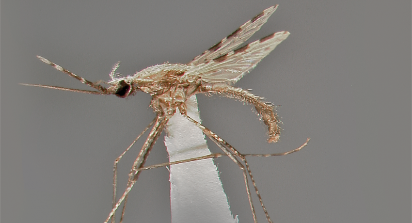
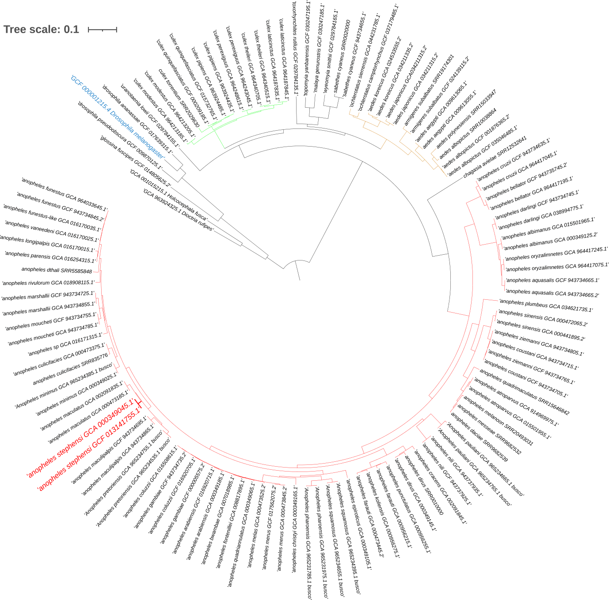
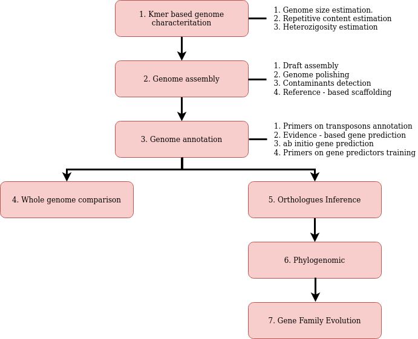

# Study system

## Anopheles stephensi

cellular organisms; Eukaryota; Opisthokonta; Metazoa; Eumetazoa; Bilateria; Protostomia; Ecdysozoa; Panarthropoda; Arthropoda; Mandibulata; Pancrustacea; Hexapoda; Insecta; Dicondylia; Pterygota; Neoptera; Endopterygota; Diptera; Nematocera; Culicomorpha; Culicoidea; Culicidae; Anophelinae; Anopheles; Cellia; Neocellia

|                 Anophenes stephensi          |                      Phylogenesis of mosquitos                 |
|----------------------------------------------|----------------------------------------------------------------|
|||

**NCBI genome sequencing related [bioproject](https://www.ncbi.nlm.nih.gov/bioproject/PRJNA629843/)**

- [short reads SRA](https://trace.ncbi.nlm.nih.gov/Traces/?view=run_browser&page_size=10&acc=SRR11672503&display=metadata)
- [long reads SRA]([text](https://trace.ncbi.nlm.nih.gov/Traces/?view=run_browser&acc=SRR11672506&display=metadata))

---

## Task list

### Disclaimer

This course introduces various software tools for solving common tasks in comparative genomics projects. However, these are just examples, biased by our habits. In real-case scenario and especially at the beginning of your career can be a good practice to explore as better as possible the universe of alternative possibilities. Indeed, biology is **extremely** complex and one software could be the best for a particular dataset but perform extremely worst for another one. In bioinformitcs we are lucky enough to not pay for each analyses, usually. So if you have the possibility try to be curious and test different tools and parameters combination.  
