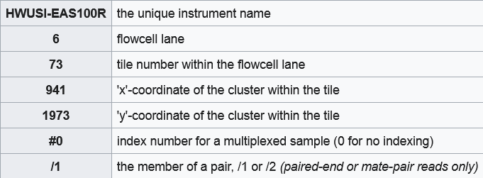
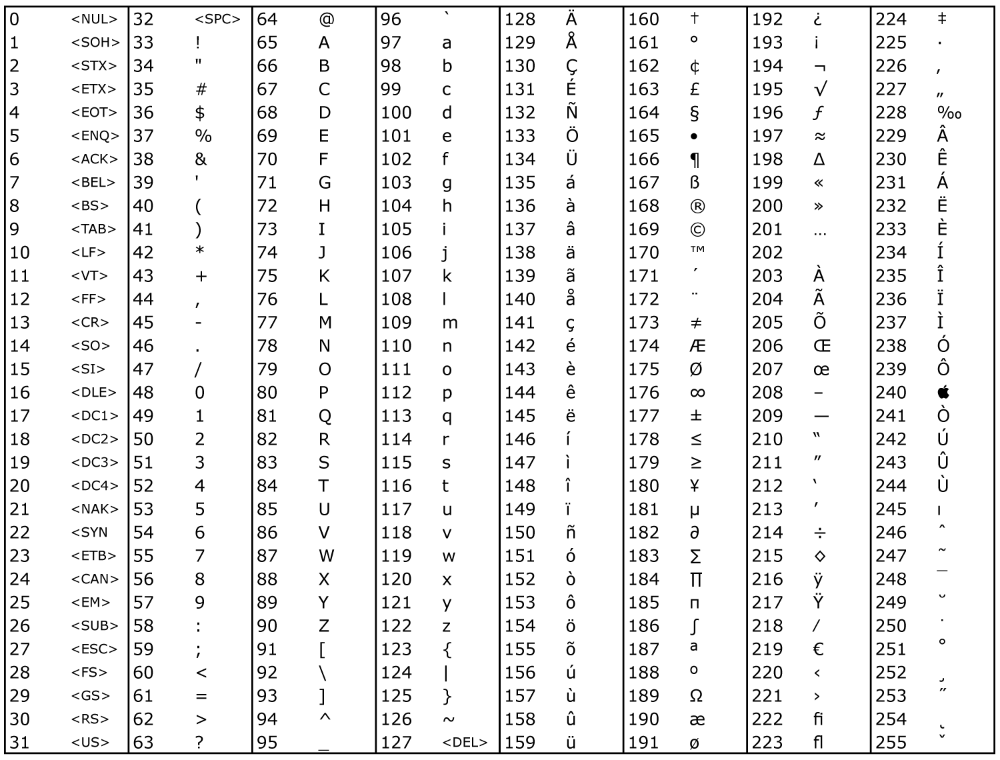
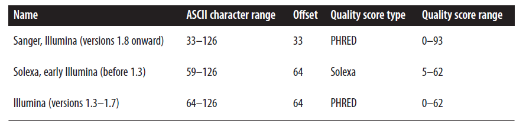
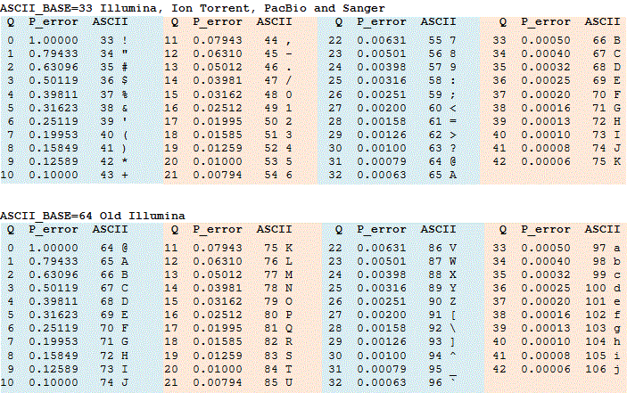

# *Omics* data and related usefull bash commands

## Fastq

FASTQ format is a text-based format for storing both a biological sequence (usually nucleotide sequence) and its corresponding quality scores. Both the sequence letter and quality score are each encoded with a single ASCII character for brevity.

FASTQ file: four lines per sequence.

* Line 1 begins with a '@' character and is followed by a sequence identifier and an optional description
* Line 2 is the raw sequence letters.
* Line 3 begins with a '+' character and is optionally followed by the same sequence identifier (and any description) again.
* Line 4 encodes the quality values for the sequence in Line 2, and must contain the same number of symbols as letters in the sequence










---

## Fasta

FASTA format is a text-based format for storing biological sequences.

FASTA file: usually two lines per sequence.

* Line 1 begins with a '>' character and is followed by a sequence identifier and an optional description
* Line 2 is the sequence.

**NB** Fasta files are usually multi - line (*i.e.* after sequence name there are more line with a fixed length for each sequence), however in bash is more straightforward to work with oneliners. A usefull command to conver a fasta file from multi - line to oneliner :

```bash
awk '/^>/ { if(NR>1) print "";  printf("%s\n",$0); next; } { printf("%s",$0);}  END {printf("\n");}' < infile.fa > outfile.fa
```

This command checks if the line starts with ">" (the header identifier in FASTA format). When it starts with it, if the line is not the first one of the file, it interspaces new headers (`printf("%s\n",$0)`) with empty lines (`print ""`). Next ensures that all headers are processes before starting with the real sequences. Then sequences are appended sequentially without new lines in empty species between headers (`{ printf("%s",$0)`). The END command conclued the file with a trailing new line.

---

## Annotation files (GFF and BED)

### GFF

Fields must be tab-separated. Also, all but the final field in each feature line must contain a value; "empty" columns should be denoted with a '.'

* seqname - name of the chromosome or scaffold; chromosome names can be given with or without the 'chr' prefix. Important note: the seqname must be one used within Ensembl, i.e. a standard chromosome name or an Ensembl identifier such as a scaffold ID, without any additional content such as species or assembly. See the example GFF output below.  
* source - name of the program that generated this feature, or the data source (database or project name).  
* feature - feature type name, e.g. Gene, Variation, Similarity.  
* start - Start position* of the feature, with sequence numbering starting at 1.  
* end - End position* of the feature, with sequence numbering starting at 1.  
* score - A floating point value.  
* strand - defined as + (forward) or - (reverse).  
* frame - One of '0', '1' or '2'. '0' indicates that the first base of the feature is the first base of a codon, '1' that the second base is the first base of a codon, and so on..  
* attribute - A semicolon-separated list of tag-value pairs, providing additional information about each feature.  

For more informations see here [GFF/GTF File Format - Definition and supported options](https://www.ensembl.org/info/website/upload/gff.html).  

### BED

The first three required BED fields are:

* chrom - The name of the chromosome (e.g. chr3, chrY, chr2_random) or scaffold (e.g. scaffold10671).  
* chromStart - The starting position of the feature in the chromosome or scaffold. The first base in a chromosome is numbered 0.  
* chromEnd - The ending position of the feature in the chromosome or scaffold. The chromEnd base is not included in the display of the feature, however, the number in position format will be represented. For example, the first 100 bases of chromosome 1 are defined as chrom=1, chromStart=0, chromEnd=100, and span the bases numbered 0-99 in our software (not 0-100), but will represent the position notation chr1:1-100.  

The 9 additional optional BED fields are:

* name - Defines the name of the BED line. This label is displayed to the left of the BED line in the Genome Browser window when the track is open to full display mode or directly to the left of the item in pack mode.  
* score - A score between 0 and 1000.  
* strand - Defines the strand. Either "." (=no strand) or "+" or "-".  

For more informations see here [BED format](http://genome.ucsc.edu/FAQ/FAQformat#format1).  

[Example](./Data/GCF_902806645.1_cgigas_uk_roslin_v1_genomic.gff) of GFF3 file. [Example](./Data/Cgig_Genes.bed) of BED file.

[BEDTOOLS](https://bedtools.readthedocs.io/en/latest/) is a comprehensive toolset for working with BED/GFF3 files. If you want to perform arithmetic operations in a genome always take a look at the numerous utilities before writing your own functions (e.g merge, compare, extend intervals).  
